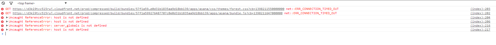

.. Testdoc documentation master file, created by
   sphinx-quickstart on Fri Sep 12 10:13:25 2014.
   You can adapt this file completely to your liking, but it should at least
   contain the root `toctree` directive.

Welcome to Testdoc's documentation!
===================================

Example image:
--------------

Links are also possible:

`Integround <http://www.integround.com>`_

Code blocks:

.. code-block:: xml

   <SupplierActivityAreas>
      <SupplierActivityArea>
         <CountryId>FI</CountryId>
         <GeographicAreaId>90</GeographicAreaId>
      </SupplierActivityArea>
      <SupplierActivityArea>
         <CountryId>FI</CountryId>
         <GeographicAreaId>90</GeographicAreaId>
      </SupplierActivityArea>
   </SupplierActivityAreas>   

.. code-block:: c#

   // ~/Models/HighlighterDbContext.cs

   using System.Data.Entity;

   namespace Hangfire.Highlighter.Models
   {
       public class HighlighterDbContext : DbContext
       {
           public HighlighterDbContext() : base("HighlighterDb")
           {
           }
       }
   }

Contents:
=========

.. toctree::
   :maxdepth: 2

   portal
   client
   faq
   licesing
